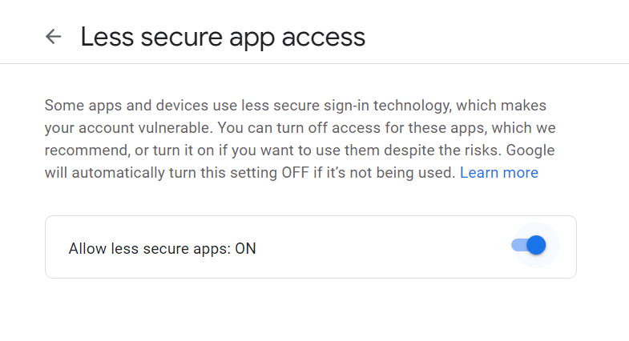
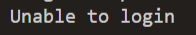
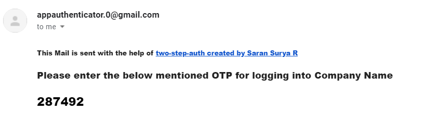

# two-step-auth

This is a npm package that helps in verifying an Email address by sending OTP

## Installation

```bash
npm i --save two-step-auth
```
## What It Does
For people developing login sections they must know if the email Id the end user provides is valid, thus this package takes in the Email ID they provide and returns you a data OTP to verify them, and sends the client one via Email, Thus making sure only verified Emails are encouraged.

## General Default Usage

**Kindly Provide a Company Name so the mail will be treated as important, but you can continue without it also**,<br/>
Usually the server responds within seconds ~ =< 2 seconds, incase the server is inactive it might take upto ~ <= 10 seconds, 
And you can handle the Time you need the OTP to be valid from your project in your script and do the necessary :)

```node.js
const {Auth} = require('two-step-auth');

async function login(emailId){
    const res = await Auth(emailId);
    // You can follw the above approach, But we recommend you to follow the one below, as the mails will be treated as important
    const res = await Auth(emailId, "Company Name");
    console.log(res);
    console.log(res.mail);
    console.log(res.OTP);
    console.log(res.success);
}

login("verificationEmail@anyDomain.com")

```

## Custom Mail ID Usage

**Kindly enable less secure apps in the link provided below, with your mail ID that you plan to use, and enable it! This will use your email ID and password to send mails to the client.** 
**Kind note we never store your passwords, and email Ids, we just transfer messages and logout :)** 
- [Kindly enable less secure apps from here](https://myaccount.google.com/lesssecureapps)

### Steps
- Pull in the **LoginCredentials** object from the package, and change the following, And they should be added before calling the Auth function (only for custom mail ID)
  - **LoginCredentials.mailID = "Your mail ID"**
  - **LoginCredentials.password = "Your Password"**
  - **LoginCredentials.use = true**

```node.js
const {Auth, LoginCredentials} = require('two-step-auth')

async function login(emailId){
    try {
        const res = await Auth(emailId, "Company Name");
        console.log(res);
        console.log(res.mail);
        console.log(res.OTP);
        console.log(res.success);
    } catch (error) {
        console.log(error)
    }
}


LoginCredentials.mailID = "yourmailId@anydomain.com" //This should have less secure apps enabled
LoginCredentials.password = "Your password" // you can store them in your env variables and access them, it will work fine
LoginCredentials.use = true

login("verificationEmail@anyDomain.com") //pass in the mail ID you need to verify

```
## you will get a error message, if less secure apps is not enabled


## Output Format
The output will be a Javascript JSON object, making it easy to work

```node.js
{
  status: 200,
  mail: 'yourEmailID@anydomain.com',
  OTP: 118740,
  success: true
}
yourEmailID@anydomain.com
118740
true

```
## Email Sample



## Contributing
Pull requests are welcome. For major changes, please open an issue first to discuss what you would like to change.

## License
[MIT](https://choosealicense.com/licenses/mit/)


## Privacy Policy
We never share the email ID's we get to any service, nor do we use them for our purposes, we regularly clean up the sent mail section, and we never save any data on our servers, we work on the main motive to be **OPEN SOURCE** , If so you have any queries kindly mail me at the email ID provided Always happy to answer :)